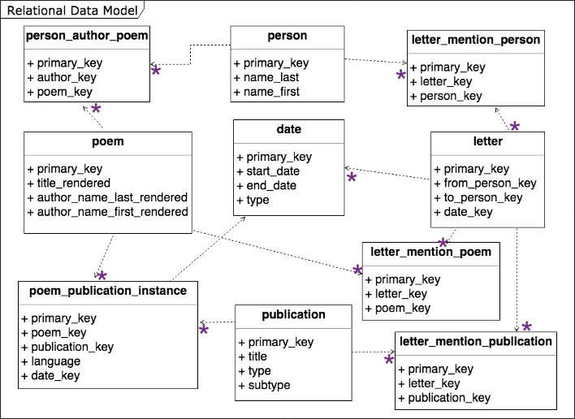
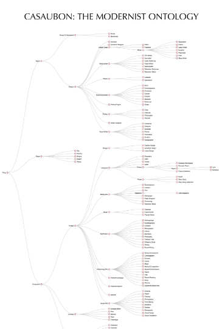

# ReMedia Infrastructure for Research and Creation - Projects
Features publicly available data, scripts, and documentation for digital humanities research.
---

## 🔗 Links

[See this portfolio in the repository](https://github.com/ecbmurphy/ReMedia_DigitalHumanities/edit/main/README.md) *images may not display in this GitHub pages site, especially in a Google Chrome browser. THey display consistently in the repository ReadMe file linked here.*
 [ReMedia Website](https://www.https://remediaresearch.ca/)

---

## About ReMedia

In ReMedia we study multimedia cultural memory: what we remember about culture, how we remember it, and how technology and media shape that memory. We take a "problem-centered," case-study approach to research. The projects below contain data, scripts, and documentation from case studies created by research partners and student research assistants. Scroll down for data related to digital humanities pedagogy. 

This portfolio provides descriptions of data building, web scraping, and computational analysis projects in ReMedia and led by the PI, Dr. Emily Christina Murphy. Some projects featured here are in-progress, and others are cleaned, completed, or on-hiaitus. This public-facing repository does not include any sensitive of living subject data. In ReMedia our primary data repository is Microsoft Teams on secure UBCO servers. If you have questions about these projects or curious to see more, please get in touch with the PI at emily.murphy@ubc.ca. 

---

## 🟢 Featured Research Projects

### 1. 🟢 [Modernist Remediations -- Goodreads data for Iconic Biography book](https://github.com/OdessyLiu/Modernist_Remediation)
- **Tech Stack:** Jupyter Notebooks, Python, .csv, jsLDA, Word2Vec
- **Student assistants:** [Odessy Liu](https://github.com/OdessyLiu/Modernist_Remediation/commits?author=OdessyLiu), Julie Carr

**Description:** 
The parent project of this dataset, "Modernist Remediations: Embodiment, Technology, and Cultural Memory," asks: on one hand, how do early 20th-century inventors and futurists imagined embodied and affective relationships to new technologies; on the other, how does the memory and technologized study of these relationships help us understand our relationship to historical and contemporary technologies? 

This case study will be part of a book, _Iconic Biography_ on the emergence of a new genre of image-text narratives: biographies in comics forms. About a quarter of these _graphic biographies_ feature figures from the early-twentieth century. In these datasets, I'm interested in how reviews data shows the reception of these graphic biographies, particularly how they may reveal readerly relationships to the historical figures they portray through mechanisms like evaluation and affective language. As a first step, I have built a dataset of publishing metadata on graphic biography publications and biographical data on historical figures, and with student RA Odessy Liu I am cleaning and refining the model for that data. The data-building work in progress is [here.](Data/Goodreads_Comics_Data/Data_Files)

We are currently using this manually built metadata to scrape Goodreads reviews using Amazon/Goodreads unique identifiers and ISBNs. Goodreads is an unprecedented resource to understand contemporary readers, and recent scholarship maps reader communities, genre formation, and perceived literary prestige using Goodreads data. I have decided to adapt a [webscraper built by Melanie Walsh and Maria Antoniak](https://github.com/melaniewalsh/Goodreads-Classics) that was used in their article "The Goodreads ‘Classics’: A Computational Study of Readers, Amazon, and Crowdsourced Amateur Criticism" (see also the dataset prepared for students in DIHU407 below). Part of my motivation is pragmatic -- to build on these scholars' work. And part is conceptual -- Walsh and Antoniak develop a theory of folksonomic tagging to address the vernacular genre of "classics." I am similarly interested in the emergence of genre. However, unlike Walsh and Antoniak's project, the genre that I wish to trace has no consistent relationship to a folksonomic tagging practice on Goodreads. So, part of the analysis will be to see whether tagging does have any relationship to this emerging genre as it is filtered through Goodreads. Part of the preparatory work will therefore be to analyze the tags/shelves that readers give to the works in the dataset, especially to analyze patterns in tag co-occurence. 

We have begun webscraping a subsection of pilot data (10% of identified titles). However, as the pilot data is not sufficiently anonymized, I am not not including it in this public repository at the moment. The eventual structure of the full dataset will be: 
Data/
├── README.md
├── Goodreads_Comics_Data/      # folder for metadata of graphic biographies
|   ├── _README.txt
|   ├── GraphicBiosNew.xlsx     # original GraphicBios file 
|   ├── GraphicBiosCleaned.csv  # graphicbios metadata file, cleaned from GraphicBiosNew.xlsx
├── Web-Scraped_Data/           # folder for scraped review data
|   ├── Raw/                                    # Raw data of scrapped reviews
|   |   ├── AllReviews/
|   |   |   ├── MainDataset/                    # Raw AllReviews data from 135 books
|   |   |   |   ├── CSV/
|   |   |   |   |   ├── AllReviews.csv
|   |   |   |   |   ├── AllReviews(1).csv
|   |   |   ├── AdditionalTitles/               # Additional Raw AllReviews data from 30 books
|   |   |   |   ├── AllReviews_AdditionalTitles.csv
|   |   ├── FirstPageReviews/                   # ?
|   ├── AllReviews_135_Unique.csv           # AllReviews data, merged and cleaned from MainDataset/
|   ├── AllReviews_Additional_30_Unique.csv # AllReviews_Additional data, merged and cleaned from AdditionalTitles/
|   ├── AllReviews.otd                      # ?
|   ├── FirstPageReviews.otd                # ?

When this data is compiled and cleaned, I will appy validated DH data analysis methods like 1) word embedding or word vector models (Word2Vec) which analyze the context of particular vocabulary at the sentence level and observe semantic patterns in how readers evaluate graphic biographies and 2) topic modelling (Mallet/LDA), which will reveal overarching trends in reader evaluation and statistical correlations among vocabulary. In addition to these two well established methods, I wish to apply some aspect-based sentiment analysis (an approach I am less familiar with) to turn particular attention towards affective language. 

I observe in many reviews that evaluative language like "meticulously researched" or "really get to know [the biographical figure]" often seems to stand in for an expression of attachment to the graphic biography. I am interested to know whether these computational methods capture or elucidate how that evaluation/attachment works at an aggregate scale. 

---

### 2. 🟢 [Modernist Remediations -- Twitter data from collaboration with Science Museum London](https://github.com/ecbmurphy/EricRobotTwitter_SML2022)
- **Tech Stack:** Twitter Developer API, Jupyter Notebooks, Python, JSON
- **Student assistants:** Julie Carr

**Description:** 
The parent project of this dataset, "Modernist Remediations: Embodiment, Technology, and Cultural Memory," asks: on one hand, how do early 20th-century inventors and futurists imagined embodied and affective relationships to new technologies; on the other, how does the memory and technologized study of these relationships help us understand our relationship to historical and contemporary technologies? 

This case study focuses on the 1928 tour and media coverage of the UK’s first robot, “Eric Robot,” and the 2017 reconstruction of Eric by the Science Museum in London. In 1928 Eric was the collaboration of William Henry Richards, a printer, journalist, newsagent, and Acting Secretary of the Society of Model Engineers, and Alan Herbert Reffell, an engineer and automotive manufacturer. In 2017, the Science Museum reconstructed Eric Robot, as a collaboration between curator Ben Russell and scrap artist and roboticist, Giles Walker. Eric was part of a larger exhibit, _Robots!_, for which the museum reconstructed several lost historical technologies. Eric is significant for the spectacle that it entailed, including a Kickstarter campaign, an NPR radio spot, and coverage by _Vice_ and the _BBC_. 

In this repository you'll find data scraped from Twitter (before it was renamed), and the scripts and literate programming notebooks we developed for scraping. The data contains scraped tweets related to Eric from 2016-2018 and control datasets from 2006-2018. 

1.	Tweets directly referencing Eric, his exhibit, and/or the Kickstarter project to rebuild him
2.	Tweets adjacent to references of Eric, eg. retweets & replies of tweets from category 1
3.	Tweets from the geographic area of the London Science Museum during the time period Eric’s exhibit was displayed
4.	**control** general sentiment towards robots and other AI-related vocabulary, both real and fictional representations from 2006-2018

The estimated size of this dataset is +500,000 JSON objects. 

- **Next Steps:**
I am in the process of developing analysis methods that apply to both this dataset and the data in project 1 above, which include sentiment analysis, word-embedding models, and topic modelling. Even though we scraped this data with the intention of retaining a control of tweets about robots other than Eric, my initial interpretation of the data suggests that there might be far more affectively charged language in the control data than the tweets related directly to Eric. 

---

### 3. 🟢 [Feminism, Modernism, and Ego-Network](https://github.com/ecbmurphy/FeminismModernismEgoNetwork)
- **Tech Stack:** Neo4j, Gephi
- **Student assistants:** [Meredith Lister](https://github.com/merelister)

**Description:** 
This project was the topic of a SSHRC postdoctoral fellowship at the University of Victoria with the Linked Modernisms project (see Linked Modernisms below), a Mellon-funded fellowship at the Harry Ransom Centre at the University of Texas at Austin, and a Hampton New Faculty Grant at the University of British Columbia. “Modernism, Feminism, and the Ego-Network” applies linked open data technologies to the personal, professional, and artistic networks of early-twentieth century women writers and editors. It asks two research questions: (1) How can contemporary technologies and social networks change how we understand the nature of women’s artistic and cultural contributions? (2) How can the study of women’s personal and artistic networks change the way we develop technologies for literary and historical inquiry? 

Most network data projects construct a whole network and measure the importance of individual notes in a network through measures like degree, closeness & betweenness centrality. In this project my goal was to experiment with modeling "ego-networks," or sets of relationships that are all connected through a single node -- in this case a person, modernist editor, author, activist, socialite, and muse, Nancy Cunard. 

At the Harry Ransom Centre, my archival research focused on the Cunard collection, recording all of the connections represented by her letters. My first approach was to create a relational database and a provisional tabular data model: 

After my fellowship at the HRC was complete, I translated this tabular data into a graphic database. You'll find that data in Letters.csv. Here is a visualization produced in Gephi that includes all of the nodes and edges represented by all letters sent and received. 

- Persons are orange
- Letters are beige
- Poems included in letters are red

The nodes in this case are people with whom Cunard exchanged letters. These results simply confirm the premise of the project, which is that Cunard is the central node of her own ego-network, represented by the letters. 

In the next phase of the project, student research assistant Meredith Lister and I translated the tabular format .csv data from the letters into a Neo4j database format. We also expanded the project to consider how the letters related to Cunard's anthology _Poems for France_(1941). Anthology forms offer an interesting case study in the role of editors in literary production, and although most studies of modernist editing focus on figures like T.S. Eliot and Maxwell Perkins, the role of women as the "midwives of modernism" (Benstock) was often effected through editing. Most of Cunard's cultural contributions were anthologies and collections, and her insufficient treatment in in modernist literary studies may result from this very multiplicity. 

In combining Cunard's letters with one of her smaller anthologies, my goal was to find a way of representing literary history focused on a figure that facilitated mediated community connection. I therefore modelled data that recorded anthologized poems, all correspondence related to those poems, and all correspondence related to anthology that did not align with a poem. You can find that dataset in the [0PoemsForFrancePrototype.xslx file](https://github.com/ecbmurphy/FeminismModernismEgoNetwork/blob/master/0PoemsForFrancePrototype.xlsx) in this repository. Our first visualization included all persons, poems, publications, and letters is similar to the letters-only network visualization. 

- Persons are orange
- Poems are red
- Publications are blue
- Letters are beige

We produced of the most interesting visualizations by removing all letters directly received or sent by Cunard. This is the result, in which Cunard is the connected orange person node in the top left. The central blue publication node in the middle surrounded by red poem nodes is the anthology _Poems for France_. 

The force-directed graph does not have any inherent meaning: the algorithm is simply trying to avoid overlapping edges, and the location of the nodes in space does not indicate any particular relationship among nodes without explicit edges. However, what is most interesting to me is the way that this visualization creates a kind of ego-network around the anthology and that, even though Cunard does not publish in the anthology, she still remains one of the most connected person nodes. The outer ring of unconnected nodes represent poems and persons mentioned in the dataset (in letters, primarily) and collections that the poems also appear in. It suggests to me a kind of ghost network of publications and literary works. 

- **Next steps:** This project is on hiaitus. Next steps will include expanding the data model from _Poems for France_ to Cunard's larger and more famous anthologies. I am curious to know how far the concept of an ego-network can actually take this work. I anticipate that adding more anthologies and revealing more "ghost networks" might mean that I need to balance ego-network modelling approaches with validated whole-network analysis like centrality and betweenness. 

---

### 4. 🟢 [LinkedModernisms](https://github.com/orgs/LinkedModernismProject/repositories)
- **Tech Stack:** JSON, CSV, Python, Apache Jena, Neo4j, SPARQL, RDFXML

*LinkedModernisms (LiMo) was a major metadata, network modelling, and natural language processing project out of the University of Victoria, where Dr. Murphy was a postdoctoral fellow and pursued her "Feminism, Modernism, and the Ego-Network" project. LiMo is currently on hiaitus, and Dr. Murphy has taken over ownership of the data and code base. LiMo will become part of future projects on multimedia cultural memory.*

**Description:** 

LiMo sought to develop Linked Open Data (LOD) approaches to modelling literary history. Linked open data is a metadata standard that may be structured to “[allow] metadata to be connected and enriched…and links made between related resources” (“Europeana Linked Open Data”), and underpins linked resources in the Semantic Web. Although all researchers invovled were literary scholars, the possibilities of LOD precipitated a shift in the objects of inquiry, away from individual texts or avant-textes and toward the much larger world of modernist cultural production. One of the primary means of framing this shift is through the development of an ontology -- a flexible data classification system -- to account for cultural production in the modernist period. It drew on previous work by the Indiana Philosophy Ontology, which uses the open access _Stanford Encyclopedia of Philosophy (SEP)_ as its database and developed an expandable ontology to support navigation of a discipline-encompassing resource. The result was the Casaubon ontology: 

Casaubon guided LiMo's envisioned, four-tier information matrix. First, information included in the _Routledge Encyclopedia of Modernism (REM)_; second, metadata about the terms in the _REM_ provided to us by domain experts; third, metadata gathered through natural language processing and inferential algorithms; and fourth, metadata about those who provided both the initial data (the entries) and the first round of metadata. From tiers 1 and 2, LiMo produced two distinct search interfaces to display the connections across nodes in the dataset. 

[See Video of Linked Modernisms relations search](https://github.com/ecbmurphy/Cunard_LiMo_Video/blob/main/LiMoSearch.mov) 

- **Next Steps:** In the original plans for LiMo, the project is to major semantic web networks like Dr. Susan Brown’s Canadian Writing Research Collaboratory (CWRC) and further developing Dr. Jon Saklofske's NewRadial visualization tool as a form of publishing. Depending on the goals of those projects and LiMo, we may still explore those possibilities. Within the ReMedia research program, LiMo offers a compelling example of metadata and code as a way of representing mediated cultural history. 

---

## 🟣 Featured Digital Humanities Pedagogy Projects

### 5. 🟣 [DIHU407: Media and Contemporary Readers](https://github.com/yourusername/project-repo)
**Description:** A summary of what this project is about and any challenges you faced.

- **Tech Stack:** [Angular, Firebase]
- **Features:**
  - Feature 1
  - Feature 2
  - Feature 3

---

### 6. 🟣 [Contract Grading Resources for IJHAC article](https://github.com/yourusername/project-repo)
**Description:** A summary of what this project is about and any challenges you faced.

- **Tech Stack:** [Angular, Firebase]
- **Features:**
  - Feature 1
  - Feature 2
  - Feature 3

---

### 7. 🟣 [Coming Soon: Repository Material for EnTwine edited collection](https://github.com/yourusername/project-repo)
**Description:** A summary of what this project is about and any challenges you faced.

- **Tech Stack:** [Angular, Firebase]
- **Features:**
  - Feature 1
  - Feature 2
  - Feature 3
